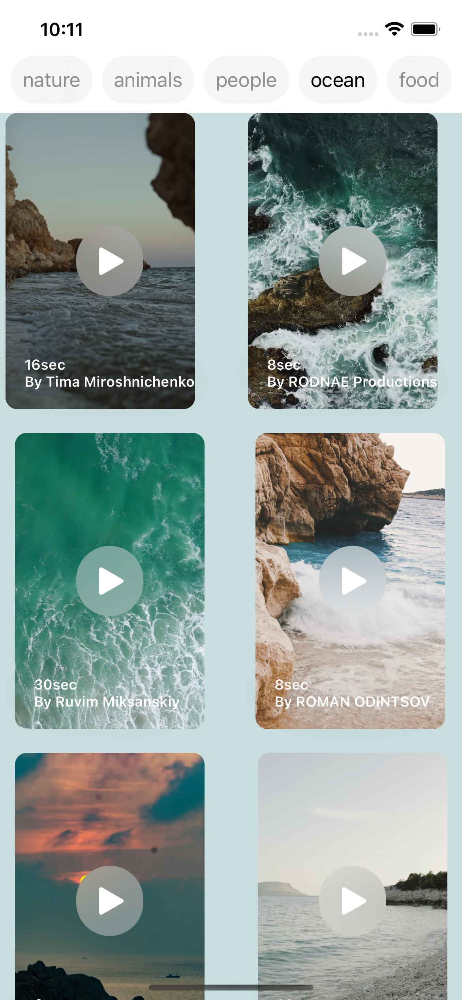
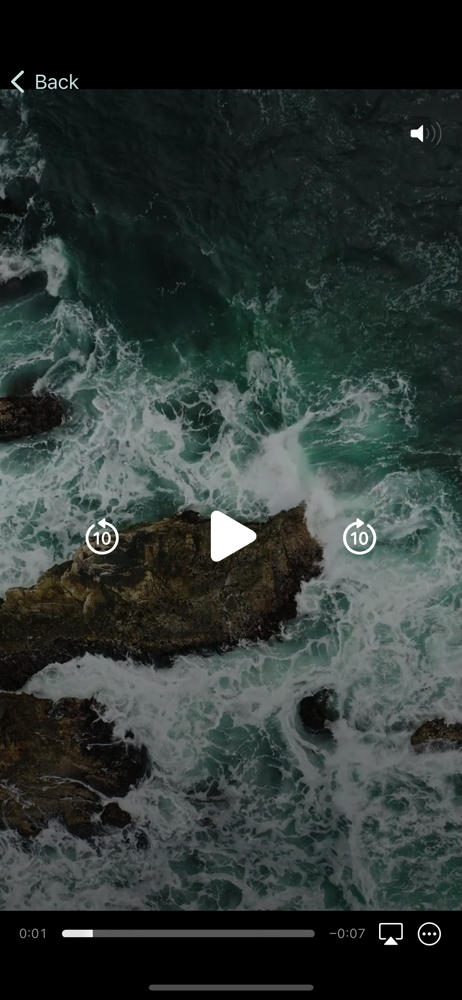
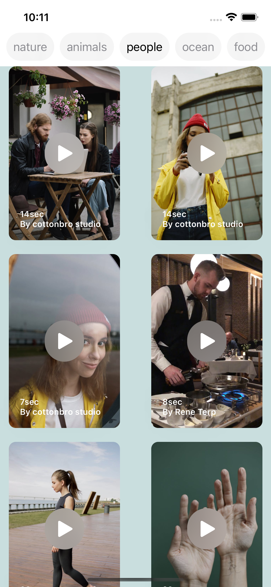

#  Video Player APP

- A videoplayer that played video from a web service using AVPlayer.

## Technologies Used
- Swift
- SwiftUI
- Xcode

- How to use AVKit Framework
- How to fetch Data from a JsonFile

